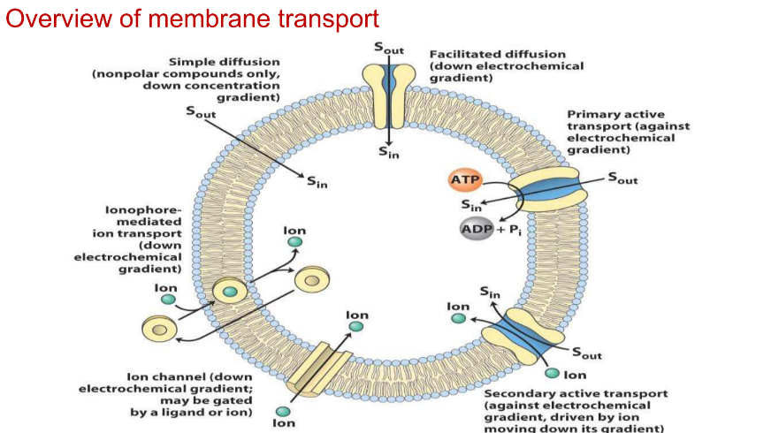

# Enzyme kinetics

## Enzyme

- **Cofactor:** Non protein (can be Organic or Non organic) compound assists in biochemical transformation. It is needed for the enhanced activity of the enzyme. **They don't bind the enzyme.** (e.g. iron in haemoglobin)

- **Conenzyme:** **CAN BE REFEREED AS ORGANIC COFACTORS** **Organic**-non-protein compounds which loosely binds to the active site for substrate recruitment.

- **Apoenzyme:** Protein part of the enzyme.

- **Holoenzyme:** (Cofactor/conenzyme)-apoenzyme complex.

  > Recall: Induced fit model

### Factors affecting enzyme activity

-  Environmental conditions
  - pH. *8-8 pH is optimal* (*because of the presence of acidic carboxylic group and basic amino group*)
  - Temperature (*extreme temperature denatures the enzyme*; *at low temperature it don't have enough energy.*)
  - Ionic concentration (*to ensure supply of metallic cofactor ions*)
- Cofactors/Coenzymes
- Inhibitors

### Enzyme Inhibitors

- **Competitive:** Imitates substrate structure
- **Non competitive:** Alters active site structure by binding to the allosteric site
- **Uncompetitive:** Binds to substrate-enzyme complex.
- **Irreversible:** Makes enzyme lose its activity.

### Michaelis-Menten equation

- Vm is maximum velocity/rate at which enzyme catalyses the reaction. Reached when all sites are saturated.
- Km 
  - Is substrate concentration at velocity half of the Vm. 
  - It implies that half of the active sites have been occupied.
  - Measure of binding strength if the active sites.
  - **Lower the value , higher the affinity b/w enzyme and substrate.**
- [S] is the substrate concentration

### Lineweaver-Burk Plot

- Essentially the plot of reciprocal of MM equation.
- **1/[S]** vs **1/V**  plot

### Eadie-Hofstree Plot

- **V/[S]** vs **V** plot.

### Hanes-Woolf plot

- **[S]** vs **[S]/V**  plot.

---

---

# Membrane Transport Proteins

